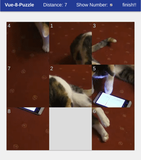
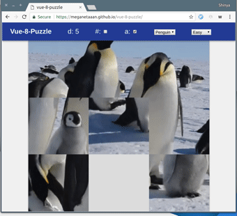
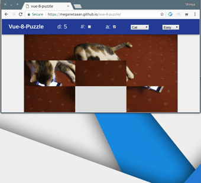

Vue-8-puzzle
===

An itty-bitty slide puzzle game made as Vue.js component

[PLAY DEMO](https://meganetaaan.github.io/vue-8-puzzle/)



Images/Videos for source



Auto-resize



## Install and Usage

```bash
$ npm install vue-8-puzzle --save
```

```JavaScript
import Vue from 'vue'
import PuzzleBoard from 'vue-8-puzzle'
import videoSrc from 'myvideo.webm'

let v = new Vue({
  el: '#app',
  template: `
    <app>
      <puzzle-board
      :src="videoSrc" />
    </app>`,
  components: {
    PuzzleBoard
  }
})
```

## Props

Props      | Type   | Description                  | Default
-----------|--------|------------------------------|--------------------------------
src | String | source path | -
sources | Array<Object> | source paths | -
cols         | number  | number of columns | 4
rows         | number  | number of rows | 4
autoResize | boolean | when true the component fits to its root automatically | false
showNumber | boolean | when true the component shows tile numbers on the video | true

## Events

Event    | Payload | Description
---------|---------|------------------------------------
init     | none    | the puzzle is initialized
start    | none    | the tile start to move
change   | none    | the tile changes
finish   | none    | all the tile is on correct position
